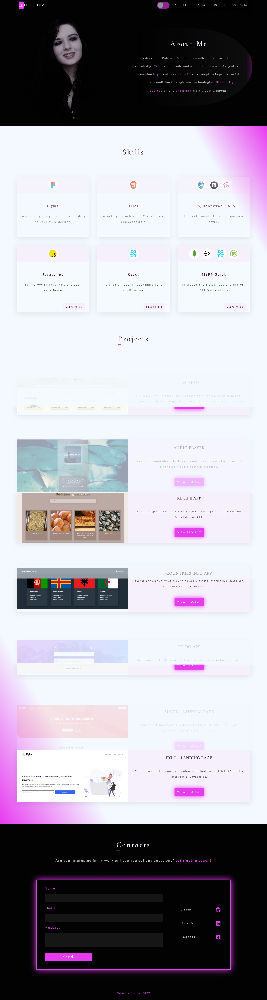
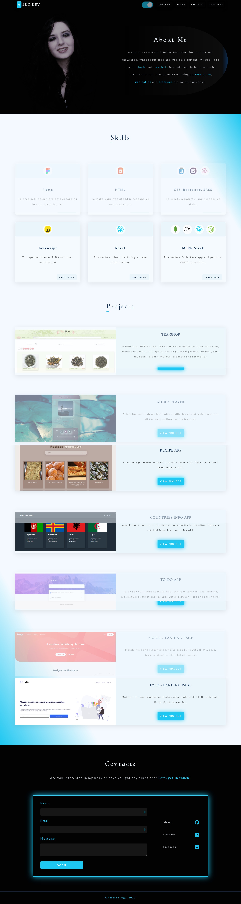

# start2impact - Personal portfolio website

start2impact is an online community and platform that offers professionalizing courses in the digital field. This is an overview of the first course project in Web & App Development.

## Table of contents

- [Overview](#overview)
  - [The challenge](#the-challenge)
  - [Screenshot](#screenshot)
  - [Links](#links)
- [My process](#my-process)
  - [Built with](#built-with)

## Overview

### The challenge

The challenge was to develop a captivating and responsive personal website/portfolio with the aim of
showing passions, skills and projects.

### Screenshot

A desktop view of the website (neon pink theme):

A desktop view of the website (neon cyan theme):

### Links to website

- Github-Pages URL: [https://auro-93.github.io/my-portfolio/]
- Netlify URL: [https://aurodev-web-developer-portfolio.netlify.app/]

## My process

### Built with

- Semantic HTML5 markup
- SEO oriented meta-tag
- SCSS
- Responsive layout
- Bootstrap 5
- Vanilla Javascript
- AOS animations library (for scrolling transitions)
- Animate.css library
